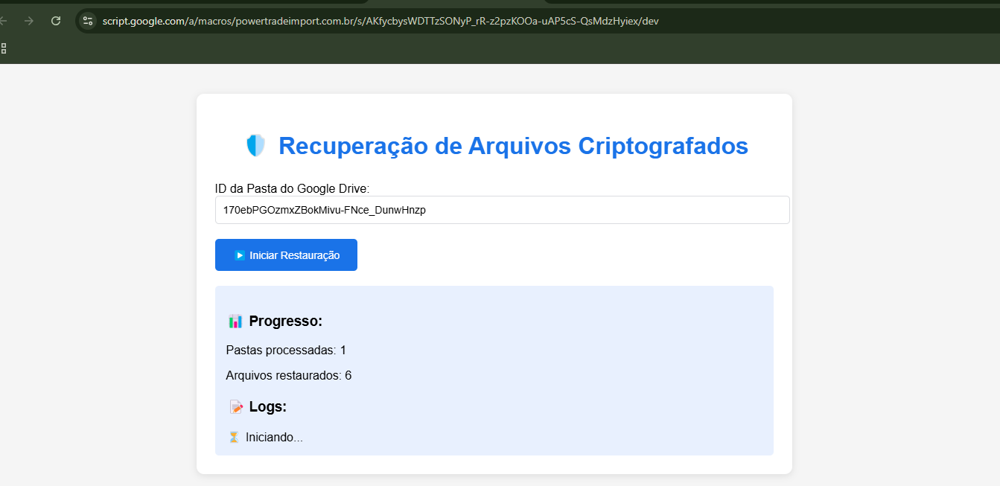
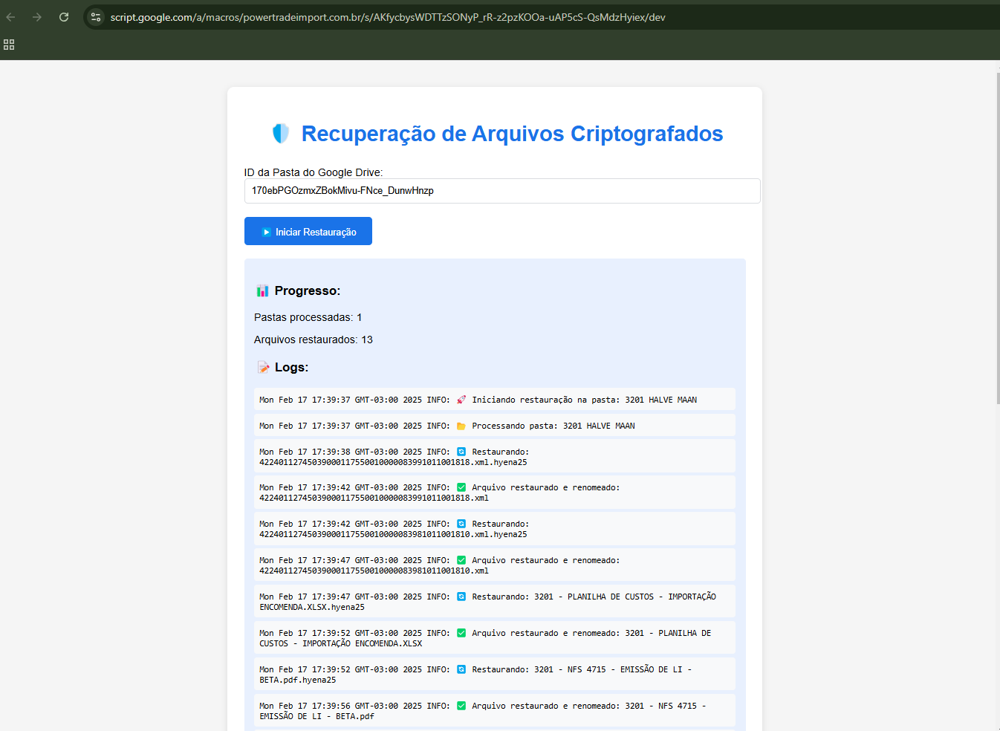

# 🔹 Script de Recuperação de Arquivos Ransomware (Hyena22)

Este script foi desenvolvido para auxiliar na recuperação de arquivos criptografados pelo ransomware **Hyena22**, que atacou uma empresa, comprometendo seus documentos no Google Drive. Para mitigar os danos, foi criada essa ferramenta em **Google Apps Script**, que verifica os arquivos afetados e restaura automaticamente suas versões anteriores ao ataque.

## 🛠 Funcionamento do Script
 

### 1️⃣ Interface Gráfica Amigável
- Para facilitar o uso, foi criada uma **tela interativa em HTML**, permitindo que os usuários insiram o **ID da pasta** no Google Drive e iniciem o processo com um clique.
- A interface exibe um **painel de progresso** que informa quantas pastas foram processadas e quantos arquivos foram restaurados.
- Um **log detalhado** é mostrado na tela, permitindo acompanhar em tempo real o que está sendo restaurado ou se há erros no processo.

### 2️⃣ Processamento dos Arquivos
- O script **percorre todas as pastas e subpastas** recursivamente, verificando arquivos potencialmente corrompidos.
- Para cada arquivo, ele verifica se há versões anteriores disponíveis. Se houver, ele recupera a **versão imediatamente anterior ao ataque**.
- Além disso, arquivos chamados **"READ_NOTE.html"**, que geralmente são deixados por ransomware como notas de resgate, são **automaticamente excluídos**.

### 3️⃣ Recuperação de Arquivos
- O script usa a API do Google Drive para listar todas as **revisões disponíveis** de um arquivo.
- Se houver mais de uma versão, ele identifica a **penúltima versão** (a mais recente antes da criptografia) e restaura o documento.
- Os arquivos são **renomeados**, removendo a extensão indesejada **“.hyena22”**, garantindo que fiquem acessíveis novamente.

### 4️⃣ Registro de Atividades (Logs)
- Durante todo o processo, o script gera logs detalhados no **Logger** e também os exibe na interface.
- O usuário pode visualizar mensagens como:
  - **📂 Processando pasta X**
  - **🔄 Restaurando arquivo Y**
  - **✅ Arquivo restaurado com sucesso**
  - **⚠️ Falha ao restaurar arquivo Z**

## 🔥 Conclusão

Este script foi uma solução eficaz para **mitigar os danos causados pelo ransomware** na empresa, permitindo restaurar arquivos sem precisar pagar resgate. Com uma **interface intuitiva**, **processamento automatizado** e **registros detalhados**, ele se tornou uma ferramenta essencial para a recuperação de dados comprometidos.
